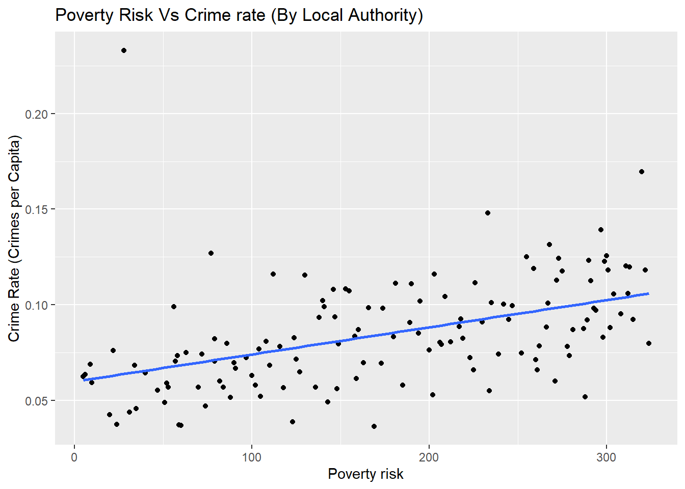
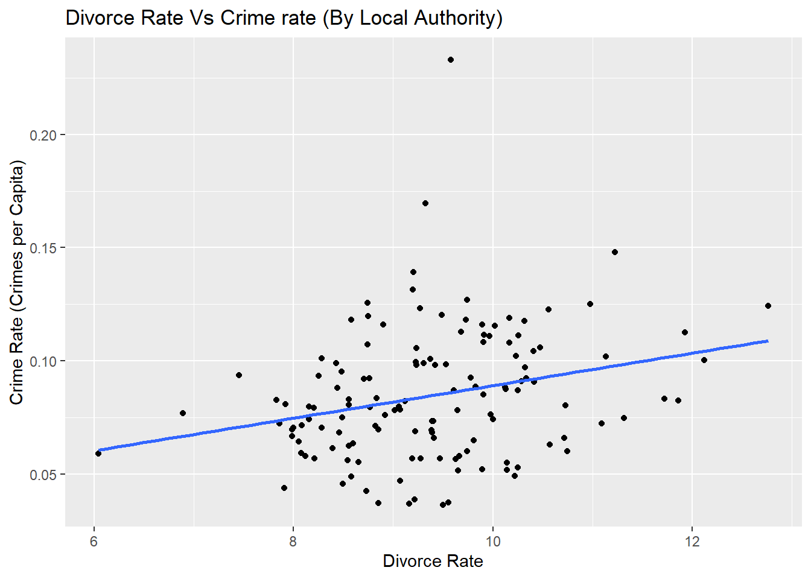
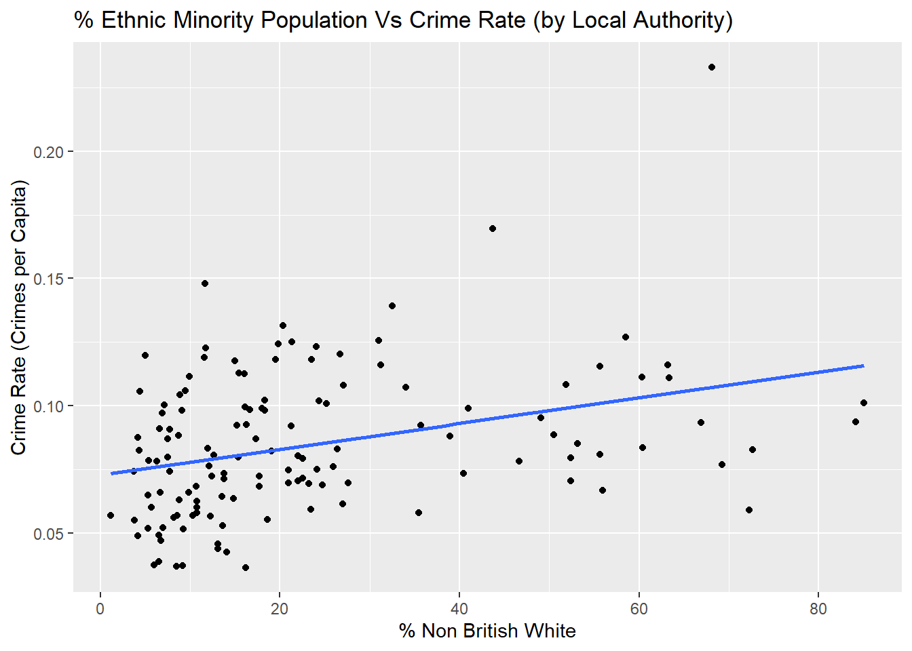
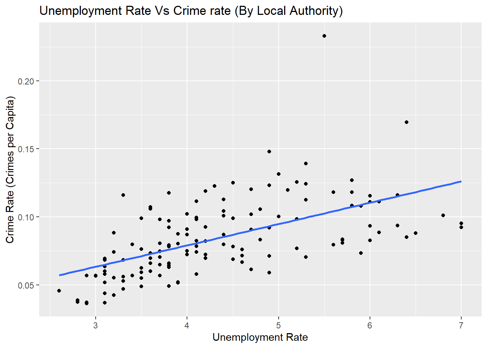
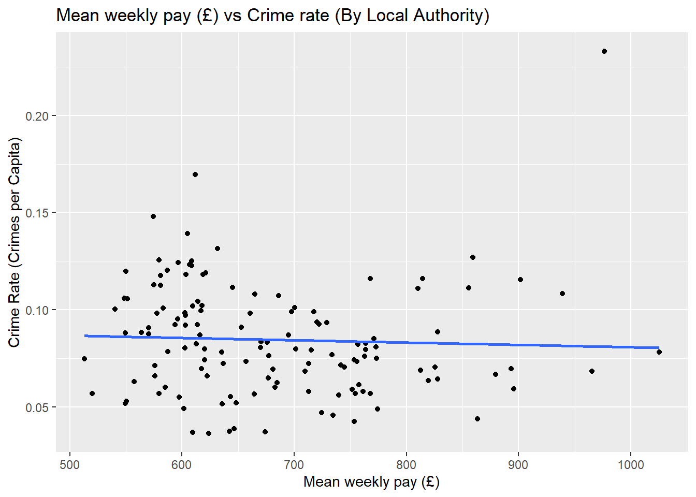
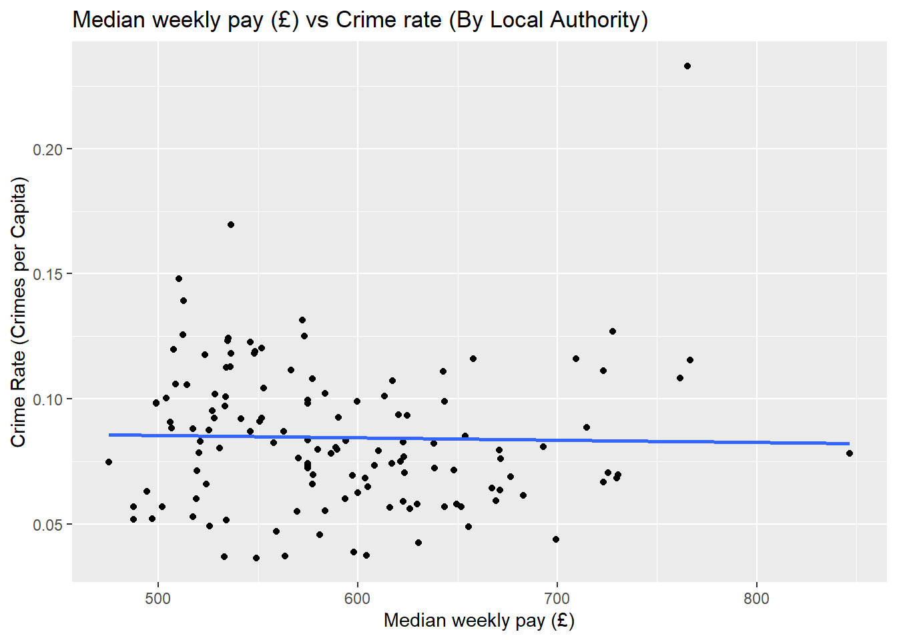
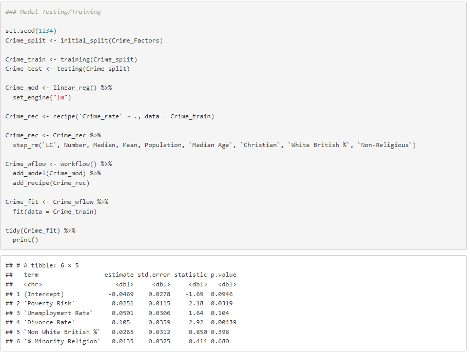
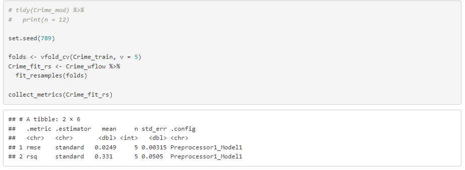
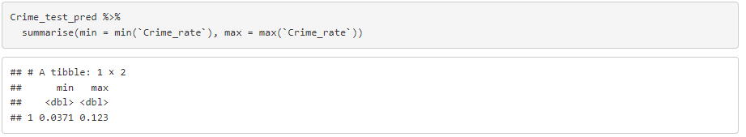

```{r install-package, include = FALSE, eval = FALSE}
# Copy and paste the following code into your console to download and install
# the `xaringan` package that contains all of the code which allows you 
# to create presentation slides in Rmarkdown
install.packages('xaringan')
```


```{r load-packages, include = FALSE}
# Add any additional packages you need to this chunk
library(tidyverse)
library(tidymodels)
library(palmerpenguins)
library(knitr)
library(xaringanthemer)
```

```{r setup, include=FALSE}
# For better figure resolution
knitr::opts_chunk$set(fig.retina = 3, dpi = 300, fig.width = 6, fig.asp = 0.618, out.width = "80%")
```

```{r load-data, include=FALSE}
# Load your data here

PunishmentsQ12023 <- read.csv("data/CSV/PunishmentsQ12023.csv")

Punishmentsminusna <- PunishmentsQ12023 %>% filter(No_of_days != ".")
Punishmentscellconfine <- Punishmentsminusna %>% filter(Punishment == "Cellular Confinement")
Punishmentsnumeric <- Punishmentscellconfine %>% mutate(No_of_days = as.numeric(No_of_days))

solitaryage <- Punishmentsnumeric %>% 
  group_by(Age_group) %>%
  summarise(
    mean_days_in_solitary = mean(No_of_days)
  )

categoryareligion <- data.frame(religion = 
  c("Muslim", "No religion", "Christian", "Other religious groups", "Buddhist", "Jewish", "Sikh", "Hindu", "Not recorded"),
percentage = c(8.563744, 4.101825, 5.171328, 5.037783, 5.015198, 8.219178, 5.633803, 2.941176, 0))

categoryasex <- data.frame(sex = 
  c("Male", "Female"),
percentage = c(5.989141, 0))

```

```{r include=FALSE}

#Background image
style_xaringan(
  title_slide_background_image = ("img/Black-Brick-Wall-Background-dark.jpg")
)
```

class: center, middle

## We pose the question of what demographic factors lead to individuals committing crime and how these factors can influence sentencing

---

```{r prison, echo = FALSE, out.width = "70%", fig.align = "left", fig.cap = "Belmarsh Prison"}
include_graphics("img/Roche-Belmarsh-Prison.jpg")
```
---

class: inverse, center, middle

# How do demographics and regional incomes influence crime rates?

---
.pull-left[
``` {r demo_graphs1, echo = FALSE, fig.align = "left"}



```

``` {r demo_graphs2, echo = FALSE, fig.align = "left"}


```
]

.pull-right[
``` {r demo_graphs3, echo = FALSE, fig.align = "right"}


```

``` {r demo_graphs4, echo = FALSE, fig.align = "right"}


```
]
---

.pull-left[
```{r demo_nongraphs1, echo = FALSE, out.width = "110%", out.height = "110%"}



```

]

.pull-right[
```{r demo_nongraphs2, echo = FALSE, out.width = "110%", out.height = "110%"}



```

]

---

.pull-top[
```{r demo_mod1, echo = FALSE, out.width = "80%", out.height = "80%", fig.align='center'}



```

]

---

.pull-top[
```{r demo_mod2, echo = FALSE, out.width = "90%", out.height = "90%", fig.align='center'}



```

]

.pull-bottom[
```{r demo_mod3, echo = FALSE, out.width = "90%", out.height = "90%", fig.align='center'}



```

]

---

class: inverse, center, middle

# Which factors have the greatest influence in crime and sentencing?

---

# Sentencing and how it is affected by a potential criminals demographics

- The prison inmate disparities respective to the United states are widely publicized and well known. 

- Bias is predominantly towards the increased conviction of African american and Latino individuals.

- These individuals expereince also expereince unfair treatment within the system when compared to their white counterparts.

- I investigated these demographics as well as others within our prison system  to see if these biases were reflected within our own prison system. 

- focus on already incarcerated individuals and treatment

---

#initial cleaning and methodology

- prior to accessing the dataset it was corrupted.

- file type 

- "." used in place of NA

- problematic variable names


---

# the dataset

- acquired from 2021 review of the prison system and it's inhabitants

- over 10,000+ entries.

- the variables that I was particularly interested in were: sex, religion, ethnicity, age, punishment and punishment length.  

- contains all the internal punishments for all prisons within England and Wales in the year 2021.

- most interested in relationships able to be identified purely visually.

- abstract statistical concepts can't be understood by majority of the population.


---

# solitary confinement lengths

- the final punishment before escalating a crime to a criminal trial is that of solitary confinement. the legal maximum for solitary confinement for the purpose of punishment is 21 days in the UK

```{r solitary-age, echo = FALSE}

ggplot(data = solitaryage, mapping = aes(y = Age_group, x = mean_days_in_solitary)) +
  geom_bar(stat = "identity") +
  labs (
    y = "age",
    x = "average days in solitary",
    title = "average time an age group spends in solitary",
    subtitle = 
      "The average amount of time each age group spends in solitary when sentenced to it as punishment whilst already incarcerated"
  )

```


---

#classification of high risk inmates

- all inmates are objectively classified on their risk to the public and their potential risk to other inmates from A to being housed in a youth facility

```{r highriskreligion, echo = FALSE}
ggplot(data = categoryareligion, mapping = aes(y = religion, x = percentage)) +
  geom_bar(stat = "identity") +
  labs (
    y = "Religion",
    x = "proportion of people in high security establishments (%)",
    title = "percentage of Religions considered to be high security risks",
  )
```

---
# high risk inmates part 2

- female prisoners can legally be classified as class A however so far there is no Class A facilities for females which results in:

```{r highrisksex, echo = FALSE}
ggplot(data = categoryasex, mapping = aes(y = sex, x = percentage)) +
  geom_bar(stat = "identity") +
  labs (
    y = "Sex",
    x = "proportion of people in high security establishments (%)",
    title = "percentage of a sex considered to be high security risks",
  )

```

---

# Findings

- all variables i.e. sex, ethnicity, age and religion all had respective areas where one was being biased.

- those aged at polar ends of the spectrum experience lower times in solitary confinement.

- Muslims and Jewish people are more likely to be classified as high risk individuals as well as men.

---

#analysis

- Those in marginalized groups are more likely to be further discriminated and placed in groups of greater discrimination.

- Those traditionally perceived as the vulnerable i.e. the young and elderly are more likely to be treated more leniently.


---